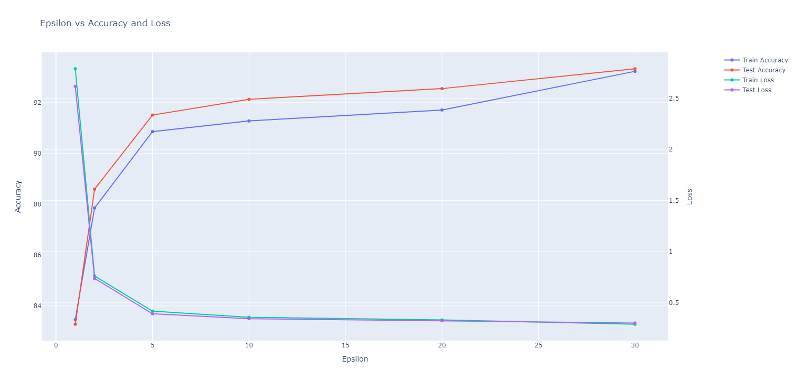

# differential-privacy-ml
Implementation of Differentially Private Machine Learning

## Files in this repository
```
Root
│   .gitignore
│   custom_logging.py
│   README.md
│   requirements.txt
│
├───baseline_pytorch
│   │   mnist.py
│   │   mnist_datasets.py
│   │
│   ├───data
│   │   └───MNIST
│   │       └───raw
│   └───saved
│           model.pth
│           optimizer.pth
│
├───baseline_tf
│       mnist.py
├───dp_sgd_opacus
│   │   mnist.py
│   │   mnist_datasets.py
│   │
│   └───saved
│           model.pth
│           optimizer.pth
│  
└───existing-code
        .gitkeep
        mnist-dp (1).ipynb
```

## How to run

To run the pytorch baseline:

    1. Clone this repository 
    2. Create a virtual env or activate an existing env
    3. Install dependencies using: `pip install -r requirements.txt`
    4. Go to the baseline directory using: `cd baseline_pytorch`
    5. Run the script using: `python mnist.py`


To run the tensorflow baseline:

    1. Clone this repository 
    2. Create a virtual env or activate an existing env
    3. Install dependencies using: `pip install -r requirements.txt`
    4. Go to the baseline directory using: `cd baseline_tf`
    5. Run the script using: `python mnist.py`


To run the pytorch-opacus dp baseline:

    1. Clone this repository 
    2. Create a virtual env or activate an existing env
    3. Install dependencies using: `pip install -r requirements.txt`
    4. Go to the baseline directory using: `cd dp_sgd_opacus`
    5. Run the script using: `python mnist.py`

## Results

### Pytorch Baselines

#### Non-DP results:
Train Accuracy: --%
Test Accuracy: 97.45%

#### DP-SGD results:

C = 4  
delta = 1e-5  
momentum = 0.9  
batch_size = 600  
learning_rate = 0.05  


| Epsilon | Sigma    | Epochs | Train Loss | Train Accuracy | Test Loss | Test Accuracy |
|---------|----------|--------|------------|----------------|-----------|---------------|
|    1    | 3.86718  |   100  |   2.7874   |     83.46      |  2.6155   |    83.28      |
|    2    | 2.13867  |   100  |   0.7625   |     87.85      |  0.7388   |    88.59      |
|    5    | 1.12548  |   100  |   0.4183   |     90.85      |  0.3925   |    91.50      |
|    10   | 0.80230  |   100  |   0.3590   |     91.27      |  0.3448   |    92.12      |
|    20   | 0.62690  |   100  |   0.3327   |     91.70      |  0.3241   |    92.54      |
|    30   | 0.62995  |   200  |   0.2906   |     93.22      |  0.3021   |    93.32      |

<p align="center">

</p>


